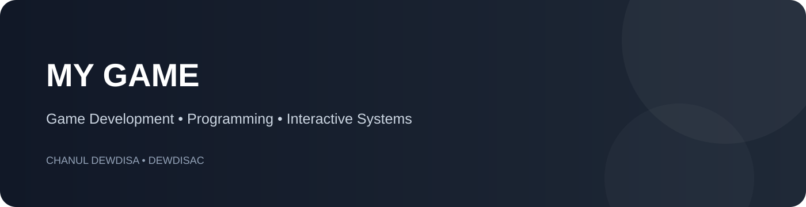

# My Game

A personal game-development project focused on programming, gameplay logic and interactive systems.

## 🎮 About

**My Game** is a personal development project created while exploring game programming and interactive software development.

The repository is used to experiment with gameplay ideas, programming patterns and the process of turning a game concept into a working project.

## 🧩 Focus

- Gameplay programming
- Game logic and state handling
- Interactive systems
- Object-oriented programming
- Experimentation and prototyping

## 🛠️ Development

This project is part of my wider journey into **game development and Unity/C#**, alongside my software engineering work.

## 🚀 Future Improvements

- Expand gameplay systems
- Improve UI and player feedback
- Add more game mechanics
- Polish the overall experience
- Package a complete playable build

## Author

**Chanul Dewdisa**

[GitHub](https://github.com/DewdisaC) • [Portfolio](https://chanul-portfolio-2027.vercel.app/)
